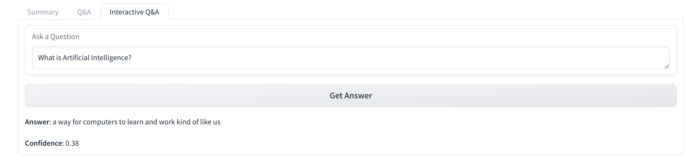

# Student Helper App (Bilingual - Arabic & English)

## Project Overview
The Student Helper App is designed to assist students in efficiently managing, reviewing, and studying educational content by leveraging advanced machine learning models. This app offers functionalities such as audio content transcription, text summarization, translation between Arabic and English, automatic question-answer generation, and interactive question-answering.

Students can upload audio files, and video files, or provide YouTube links to convert speech into text, enabling them to review and engage with educational materials effectively. The app generates relevant questions based on the transcribed content, and students can also ask their own questions to receive contextual answers. This bilingual application supports Arabic and English, making it accessible to a wider audience and enhancing the learning experience.

## Features
- **Audio and Video Processing**: Users can upload audio files, video files, or provide YouTube links for automatic transcription.
- **Bilingual Support**: The app seamlessly handles Arabic and English content, enabling users to choose their preferred language for outputs.
- **Summarization**: Provides concise summaries of transcribed content to enhance comprehension.
- **Q&A Generation**: Generates questions and answers based on the content, aiding in study preparation and review.
- **Interactive Q&A**: Students can ask questions related to the transcribed content, and the app will provide answers based on the content.
- **Text-to-Audio Conversion**: Converts summaries into audio format, allowing for auditory learning.

## Expected Outputs
1. **Summary**: A brief overview of the transcribed content.
3. **Q&A**: A set of automatically generated questions and answers based on the content.
4. **Interactive Q&A Response**: Answers to user-generated questions related to the transcribed content.
5. **Audio Summary**: An audio file of the summary for easy listening.

## Model Choices and Pipeline Explanations
1. **Transcription**
   - **Model**: OpenAI Whisper
   - **Justification**: Whisper is an advanced model that provides robust transcription capabilities for multiple languages, including Arabic. Its ability to handle diverse audio inputs makes it an excellent choice for educational content.
   - **Link**: [OpenAI Whisper](https://github.com/openai/whisper)
  
2. **Summarization**
   - **Model**: Facebook BART
   - **Justification**: BART is effective in generating coherent summaries from large text bodies, making it ideal for summarizing lectures and study materials.
   - **Link**: [Facebook BART](https://huggingface.co/facebook/bart-large-cnn)

3. **Translation**
   - **Model**: Facebook NLLB
   - **Justification**: The NLLB model is designed to support multiple languages, ensuring accurate translation between Arabic and English, thus catering to the app's bilingual focus.
   - **Link**: [Facebook NLLB](https://huggingface.co/facebook/nllb-200-distilled-600M)

4. **Question-Answering**
   - **Model**: Deepset RoBERTa
   - **Justification**: This model is optimized for question-answering tasks, providing precise answers based on the given context.
   - **Link**: [Deepset RoBERTa](https://huggingface.co/deepset/roberta-base-squad2)

5. **Question Generation**
   - **Model**: T5 Small
   - **Justification**: T5's versatility in generating questions makes it suitable for creating relevant study questions from the transcribed content.
   - **Link**: [T5 Small](https://github.com/patil-suraj/question_generation)

6. **Text-to-Speech (TTS)**
   - **Model**: gTTS 
   - **Justification**: gTTS is used to convert final text outputs (such as summaries) into audio format, allowing for auditory learning and making it easier for students to review key points by listening.
   - **Link**: [gTTS](https://pypi.org/project/gTTS/)

## Special Measures for Arabic Language Support
- **Language Detection**: The app utilizes language detection to automatically determine the language of the transcribed content, allowing for appropriate processing and translation.
- **Model Choice for Arabic Speech**: The Whisper model used in the app is the "medium" version. This choice is based on its effectiveness in accurately transcribing Arabic speech, ensuring high-quality and reliable transcriptions that cater to the specific nuances of the Arabic language.
- **Translation Support**: All outputs (transcriptions, summaries, Q&A) are translated to and from Arabic and English using advanced models, ensuring that users can engage with content in their preferred language.
- **Bilingual Interfaces**: The app’s interface dynamically adapts to display content in either Arabic or English based on user preferences.

## Usage
1. Launch the app using Gradio.
2. Select the content type (Audio Upload, Video Upload, or YouTube Link).
3. Upload the necessary files or provide a YouTube link.
4. Choose the preferred language (Arabic or English).
5. Specify if you want a summary or Q&A generation or both.
6. Click "Submit" to process the content.
7. Use the interactive Q&A feature to ask questions about the transcribed content and you will get an answer immediately.

Inputs : 

outputs: 

## Conclusion
The Student Helper App is a comprehensive tool for students looking to enhance their learning experience through automated transcription, summarization, Q&A generation, and interactive question-answering. Its bilingual capabilities make it accessible to a broader audience, ensuring that students can efficiently study and review educational materials in their preferred language.

## Notes
Hugging Face did not provide YouTube links due to concerns, and the Q&A generator was not included because the model was trained on Transformers 3.0.0, which encountered issues with Hugging Face's support for version 4.0.0

## Links
- [Hugging Face Spaces](https://huggingface.co/spaces/Shahadbal/Study-Helper)
- [Slides](https://www.canva.com/design/DAGSV7BQIVk/Qdez04HT7NZQc2py7xeEsw/edit?utm_content=DAGSV7BQIVk&utm_campaign=designshare&utm_medium=link2&utm_source=sharebutton)

## Authors : [Shahad Albalawi, Nojood Alnahdi]
